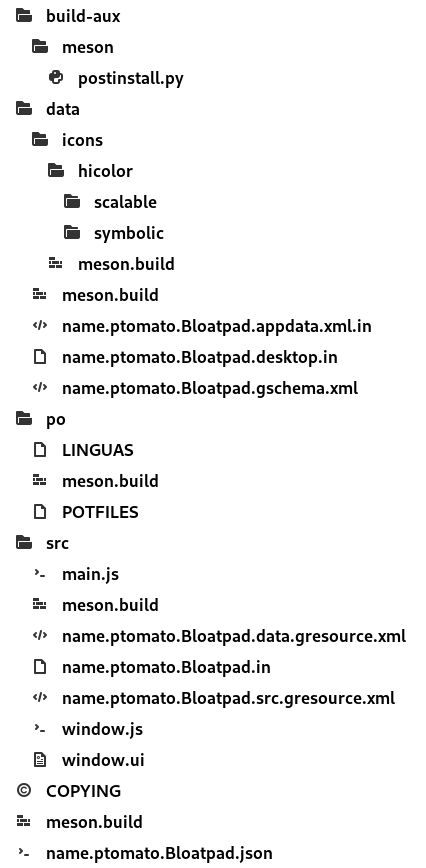
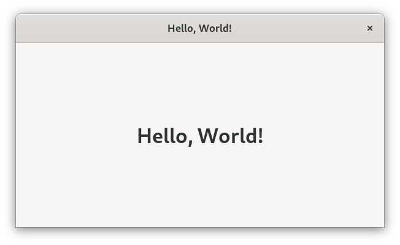
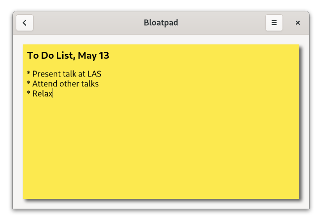
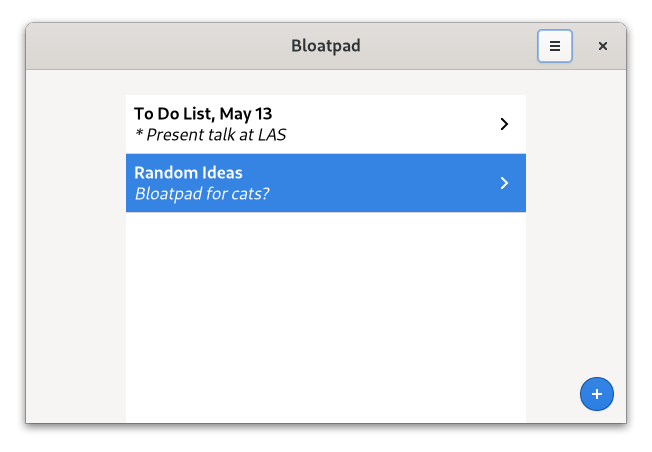

# Writing native Linux desktop apps with JavaScript

**Philip Chimento** • <i class="fab fa-gitlab"></i>&thinsp;<i class="fab fa-github"></i> ptomato • <i class="fab fa-twitter"></i> @therealptomato
Linux Application Summit, May 13, 2021

<!--
  Introduce self
-->

---

## Introduction

- I maintain [GJS](https://gitlab.gnome.org/GNOME/gjs/) (GNOME JavaScript)
- This talk is a bit of an experiment for me
- Can web JS programmers ramp up quickly on writing a desktop app?

<!--
  I'm the maintainer of GJS, which is the JavaScript bindings to the GNOME platform. This is something that people can (and do) use to write apps for the Linux desktop in JavaScript. The most famous one is probably Polari, the IRC client, but there's also Flatseal the permissions manager, and Foliate the e-book reader, etc. Many of these apps are available on Flathub, which means that even though they use the GNOME platform libraries, they work anywhere Flatpak is available.

  Traditionally we've been aiming our documentation at programmers who have already written desktop apps in other programming languages.

  But, one of the reasons we always give for even _having_ JavaScript bindings in GNOME is so that it's more familiar to web developers and they can get started quicker. Is that really true?

  I was curious about whether I could present a talk from that perspective, and this talk has sort of been brewing in the back of my mind for a long time.
-->

---

## What this talk is

- Aimed at JavaScript developers and enthusiasts
  - e.g. web developers
- Aimed at people who would like to write a desktop app
- A walk through creating and publishing a desktop app in JS

---

## What this talk is not

- A step-by-step tutorial on how to write an app
  - There's already a good one on [gjs.guide](https://gjs.guide/guides/gtk/3/)

<!--
  This is not going to be a tutorial on how to code an app. There are plenty of these already on the internet.
-->

---

## Why not Electron?

- Bandwidth / download size
- Memory usage

### Why Electron?

- Write once, run identically anywhere
- Don't want an experience adapted for the user's platform

<!--
  First of all let's talk about the more common entry points for if you are a JavaScript developer and you want to write a Linux desktop app.

  One way is to use Electron.
-->

---

## Why not a GNOME Shell extension?

- Get your own process, no need to inject your code into the desktop
- Access to a powerful and stable platform API, no guessing if a user has the dependency you need
- Target one version of GJS, no need to include fallbacks
- Your app works other places than just the GNOME desktop

### Why a GNOME Shell extension?

- Your use case specifically modifies GNOME's UI

<!--
  Another way is to publish an extension for GNOME Shell on extensions.gnome.org. This is a super low friction way to get your code into users' hands, and it's being made even more frictionless with an ongoing documentation push and more reviewers volunteering for extensions.gnome.org.

  A shell extension is sometimes the right tool for the job, and sometimes it isn't.

  It allows you to modify 
-->

---

<!-- _class: invert lead -->

# Let's get started!

<!--
  Going to talk about the process of setting up your project and 
-->

---

<!-- _class: lead -->

# App: "Bloatpad"


<!--
  There's a long tradition of having an app in the GTK documentation called "Bloatpad", so I'm going to steal that name.
-->

---


## Have something to start with

---



- a Meson build system
- a placeholder icon
- resource bundles
- a `.desktop` file
- a settings schema
- an AppData description
- infrastructure for i18n
- skeleton code
- a Flatpak manifest

---

## Yarn

- Meson is great
- You will need it if your app ever includes any C code
- Coming from JS development you still might want something more familiar

```sh
$ yarn init
```

```json
"scripts": {
  "prebuild": "test -d _build || meson _build",
  "build": "ninja -C _build",
  "start": "meson compile -C _build devel",
  "test": "meson test -C _build"
}
```

<!--
  Meson is great, I love it, and you'll definitely need it if your app is going to include any C code that gets imported into JavaScript.

  Yarn will allow you to easily install popular JavaScript developer tools that you're familiar with
-->

---

## Yarn

```sh
$ yarn build
$ yarn start
```



---

## Yarn

- Beware of Meson/Ninja needing to run Yarn

```json
"desktop-file": "msgfmt --template=..." // ⚠️ Don't do this
```

<!--
  What you _don't_ want to do is make Yarn scripts that produce dependencies that Meson will later need for other things. Keep Yarn scripts for development tools such as linters
-->

---

## License check

- Consider following the [reuse.software](https://reuse.software/) guidelines
- Makes sure all your files are clearly licensed

```sh
$ pip3 install --user reuse
```

```json
"license": "reuse lint"
```

---

## Linter

- May as well install [prettier](https://prettier.io/) and never again worry about code style
- [eslint](https://eslint.org/) for usage 

```sh
$ yarn add --dev prettier eslint
```

```json
"lint": "eslint . --fix && prettier --write ."
```

<!--
    eslint: unused variables, etc.
-->

---

## TypeScript

- You can write in TypeScript, it _mostly_ works
- Or write JS with type annotations in comments and use TypeScript to typecheck
- Thanks to the [hard work](https://gitlab.gnome.org/ewlsh/gi.ts) of Evan Welsh

<!--
  TypeScript mostly works thanks to the hard work of Evan Welsh.
  You can use it in two ways. The simplest way is to write regular JavaScript, and use the TypeScript compiler as a linter
-->

---

## Other build tools

- Bundlers are probably not needed
  - Tree shaking can be useful
  - use e.g. [find-unused-exports](https://www.npmjs.com/package/find-unused-exports)
- Minifiers are probably not needed
- Babel probably works

<!--
  A lot of the JS build tool effort revolves around bundling. Bundlers are probably not needed when writing a native desktop app. The default project skeleton that I mentioned before includes build code to put all of the sources and data files into a GResource bundle, which is loaded into memory at startup, making module imports lightning-fast.

  One thing that bundlers do is tree-shaking, meaning elimination of dead code. This is vital in web development where you either have to shake the tree to remove library functions from your dependencies that you aren't using, or use thousands of tiny one-thing-only dependencies like leftpad. It's not so vital in our situation because we have an entire platform made available to us in the form of C libraries with JS bindings, which is there whether we use it or not. But still, eliminating dead code in your own codebase is useful, and there are NPM packages such as find-unused-exports for that.

  Minifying your code isn't really needed either when writing a native desktop app. With GResource bundles, the disk I/O is done only once, and since there is far less JS code than in a typical website, load time is not really a problem.

  Transpilers such as Babel probably work with a bit of custom configuration. Depends on what exactly you are transpiling. You might not need it at all because you don't need to support old browsers and engines in your app, so you can just write modern JavaScript by default.

  (although you might use a bundler if you use runtime dependencies from NPM, more about that in the next slide)
-->

---

<!-- _class: invert lead -->

# Designing the UI

---

## XML UI files or no?

- XML-CSS-JS is like the web development trinity of HTML-CSS-JS
- Alternative is to build your UI in code

<!--
    If you come from web development, building your UI in code is roughly the same thing as assembling an HTML DOM using document.createElement() in your code. That would be pretty ridiculous and is not really a feasible alternative in web development. This is different with GJS, because of the GNOME platform's C heritage.

    On the other hand, in web development we have things like JSX, which we do not have in GJS.
-->

---

## XML UI files or no?

```xml
<object class="GtkListView" id="notesList">
  <property name="show-separators">True</property>
  <signal name="activate" handler="_onNotesListActivate"/>
</object>
```

vs.

```javascript
this._notesList = new Gtk.ListView({ showSeparators: true });
this._notesList.connect("activate", this._onNotesListActivate.bind(this));
```

---

## XML UI files

- Tedious to write by hand
- [Glade UI Designer](https://glade.gnome.org/)
  - GTK 3 only
  - GTK 4 alternative [underway](https://blogs.gnome.org/xjuan/2021/02/28/cambalache/)

---

## Glade UI Designer


---

## Result


---

## CSS


```css
.large-icon {
  color: #888a85;
  -gtk-icon-shadow: #d3d7cf 1px 1px;
  padding-right: 8px;
}
```
---

## CSS


---

<!-- _class: invert lead -->

# Time to write code

<!--
    Now we have a base on which to build, that should be familiar if you come from a JS background.
    Time to write some code.
    This isn't going to be a tutorial of how to write a GTK app — you can find plenty of those online — but I'll show some of the cool and unique stuff that 
-->

---

## API Documentation

- [gjs-docs.gnome.org](https://gjs-docs.gnome.org)


---

## About the API

- Everything is based on `Gtk.Widget`
- Roughly equivalent to a HTML DOM element
  - Methods
  - Properties
  - Signals (events)

---

## ES modules

```js
import Gdk from "gi://Gtk";
import Gio from "gi://Gio";
import GObject from "gi://GObject";
import Gtk from "gi://Gtk";

import { NotesListItem } from "./item.js";
```

<!--
  This is something new that you might not realize works natively in GJS. We have ES modules, thanks to the initiative of Evan Welsh.
-->

---

## Async operations

- GNOME platform has asynchronous, cancellable I/O
- Experimental opt-in support for JS `await`

```js
Gio._promisify(Gio.OutputStream.prototype, 'write_bytes_async', 'write_bytes_finish');

// ...

let bytesWritten = 0;
while (bytesWritten < bytes.length) {
  bytesWritten = await stream.write_bytes_async(bytes, priority, cancellable);
  bytes = bytes.slice(bytesWritten);
}
```

<!--
  In the GNOME platform, all I/O is cancellable, as well.
  It works using callback-style, but we have experimental support for Promise-style.
  You opt-in to it for each method like this, at the start of your program.
  Once you've done that, then you can use it like down here, with `await`.

  This was actually done by an Outreachy intern a couple of years ago, and we have another Outreachy internship that's still in the application period for working on making it less experimental.
-->

---

## Popular runtime libraries

- These may or may not work
- Check if you actually need the dependency
- Use ES module directly if it doesn't have other deps
- Some modules ship a browser bundle, this might work
- Else, build a UMD bundle with Browserify and vendor it

<!--
  You might want to use a library from the web development ecosystem that you're familiar with.
  First of all, check if you actually need this library. In some cases, you don't. It might be something that the GNOME platform already provides in another way, like network I/O. Or it might be a dependency that is no longer needed because in the desktop you can target modern JS.

  If you do need the library, check if it has any Node dependencies. Then check if it ships an ES module entry point. If it has no dependencies and ships an ES module, great, then you can probably just copy that into your sources, import it directly and it'll work. (Problems occur when you want to import Node builtins like 'os' or when you want to resolve other modules from the node_modules directory which GJS doesn't know about.)

  If no ES module, check if the module ships a browser bundle that's already built. Some modules do this, so you can copy _that_ into your sources.

  If not, you can build your own with Browserify.
-->

---

## Build a UMD bundle with browserify

```sh
yarn add my-library
mkdir -p src/vendor
npx browserify -r my-library -s myLibrary -o src/vendor/my-library.js
```

```js
import './vendor/my-library.js';
// myLibrary is now a global object
```

<!--
  Here's how to do this Browserify trick. You can import the UMD module for its side effect, which is to install the library as a global object.

  This is the best way that I've found to do this. It works okay, but isn't ideal. It would be cool if someone would write a Rollup plugin for GJS modules or something! Or there might be a better way that already exists that I haven't found yet.
-->

---

## [Top 5](https://gist.github.com/anvaka/8e8fa57c7ee1350e3491) most used NPM libraries

1. lodash
2. chalk
3. request
4. commander
5. react

<!--
  Interestingly, by taking a look at the top 5 depended-upon NPM libraries (from this list of 1000), we can see examples of all of the ways of using them in your GJS app.
-->

---

## Lodash

- In some cases not necessary
- Use `lodash-es` if you need lodash

```js
import _ from './vendor/lodash-es/lodash.js';
_.defaults({ 'a': 1 }, { 'a': 3, 'b': 2 });
```

<!--
  Top of the list is Lodash!
  
  First of all, consider if you really need lodash. Many of the functions it provides are actually not always necessary using the modern JavaScript that GJS allows you to target. For instance, this example with `_.defaults` can be replaced with object destructuring.

  However, if you do need Lodash for something, it does provide an ES module with no dependencies, in the `lodash-es` package. You can copy the file from this package into your source directory, and import it in your code like this.
-->

---

## Chalk

- No bundle, so make a Browserified one
- Color support detection code is Node-only
  - Edit bundle, change `stdout: false` and `stderr: false` to `true`

```js
import './vendor/chalk.js';
print(chalk.blue('Hello') + ' World' + chalk.red('!'));
```

<!--
  Chalk is a popular library for printing ANSI color codes to the terminal. It doesn't ship a browser bundle. It does ship an ES module, but that imports other modules that need Node module resolution, so we can't use that directly either. So, we use the Browserify trick to build a UMD bundle.

  We also need to make one edit in the generated bundle. By default, ANSI colors are disabled in the browser bundle, since browsers mostly don't support them. After making that edit, Chalk works.
-->

---

## Request

- Deprecated
- Use [`Soup`](https://gjs-docs.gnome.org/soup24/) instead

```js
const request = require('request');
request('https://ptomato.name', function (error, response, body) {
  console.error('error:', error);
  console.log('statusCode:', response && response.statusCode);
  console.log('body:', body);
});
```

```js
import Soup from 'gi://Soup';
const session = new Soup.Session();
const msg = new Soup.Message({ method: 'GET', uri: new Soup.URI('https://ptomato.name') });
session.queue_message(msg, (_, {statusCode, responseBody}) => {
  log(`statusCode: ${statusCode}`);
  log(`body: ${responseBody.data}`);
});
```

<!--
  Request is a very popular library but has been moved to maintenance mode because there are better ways to do requests in modern JS.
  The GNOME platform does provide one!
  Libsoup, for example, will integrate with GNOME's main loop.
  In the upcoming libsoup 3, there will be an API that will integrate better with async/await.
  So, despite Request being one of the most depended-on modules, in new code you may as well use something else.
-->

---

## Commander

- No bundle, so make a Browserified one

```js
import System from 'system';
import './vendor/commander.js';
const { Command } = commander;

const options = new Command()
  .option('-p, --pizza-type <type>', 'flavour of pizza')
  .parse(System.programArgs, { from: 'user' })
  .opts();                  // ^^^^^^^^^^^^

if (options.pizzaType) print(`pizza flavour: ${options.pizzaType}`);
```

<!--
  Commander is a library for parsing command line options.
  This one needs the same browserify trick.
  Note the from: 'user' there, this is different from how you would pass process.argv in Node
-->

---

## React

- Not applicable

<span style="font-size: 55%">P.S. Although it would be cool if React Native worked with GTK</span>

<!--
  The final of the top 5 libraries is React, which is its own thing. It doesn't really apply to writing GTK apps, as it's a library for making user interfaces in the HTML DOM.

  Although there is a library React Native which abstracts over different mobile platforms, allowing you to write native iOS and Android apps in JS; it would be really cool if this worked for GTK!
-->

---

<!-- _class: invert lead -->

## Fast-forward to the [written code](https://github.com/ptomato/bloatpad)

(Live demo, but in case that doesn't work out, screenshots follow)

<!--
  Well, as I said at the beginning, this isn't a tutorial on how to write an app, so we'll skip the part of writing the actual code of Bloatpad. I've linked to the code in my slides here, so you can click on it later if you're interested.
-->

---


---



---



<!--
  So. What now?
-->

---

<!-- _class: invert lead -->

# Distributing your app to users

---

## How?

- [Flathub](https://flathub.org/home)
- [Requirements](https://github.com/flathub/flathub/wiki/App-Requirements)
  - Luckily, the new project skeleton meets all of these
  - Only need to customize a few things

---

## AppData file

- [Flathub guidelines](https://github.com/flathub/flathub/wiki/AppData-Guidelines)
- [Description of file format](https://www.freedesktop.org/software/appstream/docs/chap-Metadata.html)
- Screenshots
- [OARS](https://hughsie.github.io/oars/index.html) rating

---

## Desktop file

- [Description of file format](https://specifications.freedesktop.org/desktop-entry-spec/desktop-entry-spec-latest.html#recognized-keys)
- [List of categories](https://specifications.freedesktop.org/menu-spec/latest/apa.html)

---

## Desktop file

```ini
# SPDX-License-Identifier: MIT
# SPDX-FileCopyrightText: 2021 Philip Chimento
[Desktop Entry]
Name=Bloatpad
Comment=Unnecessary note-taking application
Exec=name.ptomato.Bloatpad
Icon=name.ptomato.Bloatpad
Terminal=false
Type=Application
Categories=Utility;GTK;
StartupNotify=true
```

---

## Application icon

 

- Tobias Bernard on [Designing an Icon for your App](https://blogs.gnome.org/tbernard/2019/12/30/designing-an-icon-for-your-app/)

---

## Submit to Flathub

- Fork the [Flathub repository](https://github.com/flathub/flathub) on GitHub
- Clone the fork
- Create a new branch with your app's name (e.g. `name.ptomato.Bloatpad`)
- Add your app's manifest to the branch, commit it and push the commit
- Open a pull request against the `new-pr` branch on Github

---

## Submit to Flathub

- That's all
- Instructions [here](https://github.com/flathub/flathub/wiki/App-Submission#how-to-submit-an-app)

---

## Consider GNOME Circle

- Apply for membership at [circle.gnome.org](https://circle.gnome.org/)


<!--
  This isn't a requirement by any means — Flathub isn't GNOME, and contains plenty of applications that don't integrate with GNOME. But if you are using GJS to write your app in JavaScript and you are using this application template from Builder, you're actually already pretty close to the requirements for integrating with the GNOME desktop, so this might be something to consider!
-->

---

## Recruit translators

---

<!-- _class: lead invert -->

# Questions

---

<!-- _class: lead invert -->

# Thank you!

