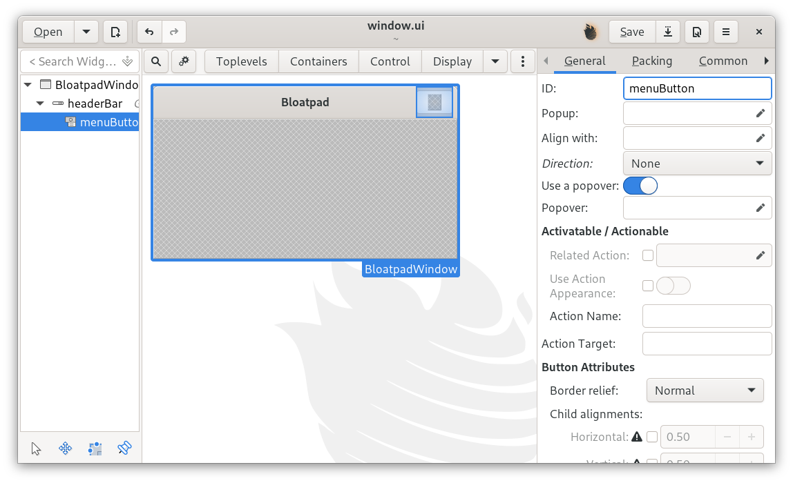
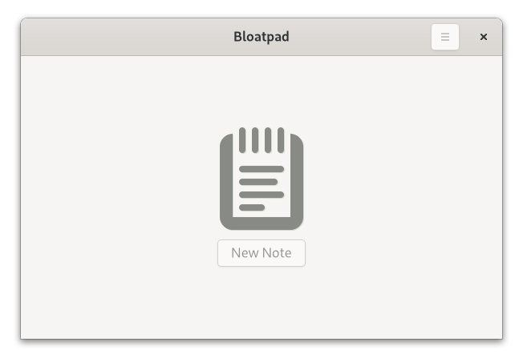
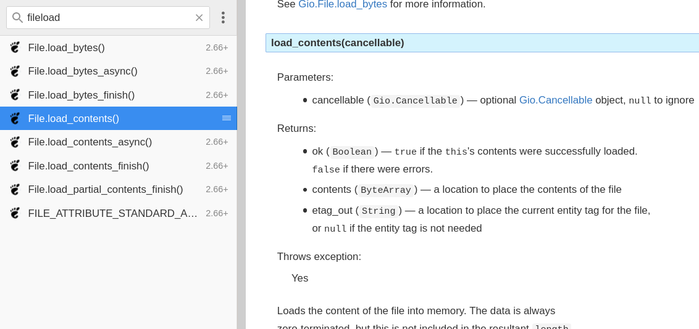
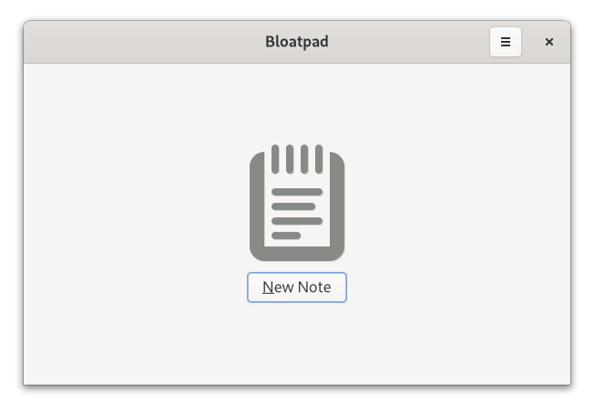
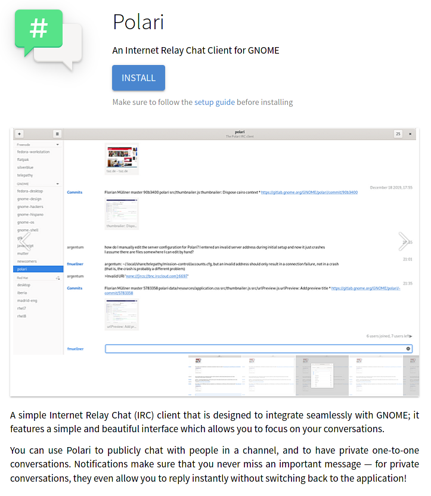

<!--
_footer: Image by <a href="https://pixabay.com/users/skorchanov-5650284/?utm_source=link-attribution&amp;utm_medium=referral&amp;utm_campaign=image&amp;utm_content=5281165">Сергей Корчанов</a> from <a href="https://pixabay.com/?utm_source=link-attribution&amp;utm_medium=referral&amp;utm_campaign=image&amp;utm_content=5281165">Pixabay</a>
-->


# Writing native Linux desktop apps with JavaScript

**Philip Chimento** • <i class="fab fa-gitlab"></i>&thinsp;<i class="fab fa-github"></i> ptomato • <i class="fab fa-twitter"></i> @therealptomato
Linux Application Summit, May 13, 2021

<!--
  Introduce self
-->

---

## Introduction

- I maintain [GJS](https://gitlab.gnome.org/GNOME/gjs/) (GNOME JavaScript)
- This talk is a bit of an experiment for me
- Can web JS programmers ramp up quickly on writing a desktop app?

<!--
  I'm the maintainer of GJS, which is the JavaScript bindings to the GNOME platform. GJS is something that people can (and do) use to write apps for the Linux desktop in JavaScript. The most famous one is probably Polari, the IRC client, but there's also Flatseal the permissions manager, and Foliate the e-book reader, etc. Many of these apps are available on Flathub, which means that even though they use the GNOME platform libraries, they work anywhere Flatpak is available.

  Traditionally we've been aiming our documentation at programmers who have already written desktop apps in other programming languages.

  But, one of the reasons we always give for even _having_ JavaScript bindings in GNOME is so that it's more familiar to web developers and they can get started quicker. Is that really true?

  I was curious about whether I could present a talk from that perspective, and this talk has sort of been brewing in the back of my mind for a long time.
-->

---

## What this talk is

- For JavaScript developers and enthusiasts
  - who are curious about writing a desktop app
- A walk through creating and publishing a desktop app in JS
  - Technologies: GJS, GTK, Flatpak, Flathub
- A slide deck that you can read later
  - https://ptomato.name/talks/las2021/

<!--
  This talk is for people who know JavaScript from other contexts and are interested in how they could use their existing knowledge to write an app for the Linux desktop.

  It'll consist of a walkthrough, with some digressions, from setting up a project skeleton and developer tools, to things that you might want to know while coding, to distribution via Flathub.

  It's important to note that a few years ago, this talk would have only applied to the GNOME desktop, because GJS and GTK are part of the GNOME platform. But with Flatpak and Flathub, you can basically write and publish an app and it'll work on any Linux desktop.

  The other thing that this talk is, is a resource that you can go back to later and re-read and click on all the links in it.
-->

---

## What this talk is not

- A step-by-step tutorial on how to write an app
  - There's already a good one on [gjs.guide](https://gjs.guide/guides/gtk/3/)
- Presented by an experienced web developer

<!--
  This is not going to be a tutorial on how to code a desktop app. There are plenty of these already.

  Another thing this talk is not. This talk is not presented by an experienced web developer. I do know some things about web development in JavaScript, but I am not really familiar with the latest tools and best practices for developing apps. I'm a Linux desktop programmer at heart, and in my day job at Igalia I work on JavaScript engines in browsers. Like I said, this talk is an experiment for me! So I might get some of these things wrong.
-->

---

<!--
_class: invert lead
_footer: <a href="https://www.pexels.com/photo/short-fur-black-orange-and-gray-cat-208984/">Image CC0 licensed</a>
-->


# Let's get started!

<!--
  So let's go! I'm going to talk first about the process of setting up your project and how you might want to organize your development tools. This cat wants us to get on with it already!
-->

---

<!-- _class: lead -->


# App: **"Bloatpad"**
## the unnecessary note-taking app

<!--
  We need an app to build, though!

  There's a long tradition of having an example app in the GTK documentation called "Bloatpad", so I stole that name. Sadly, I did not make up this pun. You can see my sketches in the background here. The tag line of this app is going to be "Unnecessary note-taking app" because really, there are plenty of good note-taking apps already, and Bloatpad is not going to shatter any paradigms.
-->

---


## Have something to start with

- Can also use [gtk-js-app](https://github.com/gcampax/gtk-js-app)

<!--
  If you're using GNOME Builder as your editor, or even if you're not, you can create a project skeleton using Builder's 'new project' dialog.

  You can also clone this gtk-js-app repository as a starting point. They are very similar and I think one was probably based on the other.
-->

---


- a Meson build system
- a placeholder icon
- resource bundles
- a `.desktop` file
- a settings schema
- an AppStream meta info file
- infrastructure for i18n
- skeleton code
- a Flatpak manifest

<!--
  Here's a list of what this gives you. We'll come back to most of these things at some point in the talk.
-->

---

## Build systems

- Meson is probably a good one to stick with
- You will need it if your app ever includes any C code
- Coming from JS development you still might want something more familiar

```sh
$ yarn init
```

```json
"scripts": {
  "prebuild": "test -d _build || meson _build",
  "build": "ninja -C _build",
  "start": "meson compile -C _build devel",
  "test": "meson test -C _build"
}
```

<!--
  So, build systems.

  The build system included in the project skeleton is Meson, which is popular for compiled languages. I'd say it's a pretty unfamiliar system for JavaScript.

  Meson is great, and you'll definitely need it if your app is going to include any native code that gets imported into JavaScript, as many desktop apps eventually end up doing. So I'd recommend keeping it.

  But if you know the JavaScript ecosystem, you'll be familiar with Yarn. Yarn will allow you to easily install popular JavaScript development tools like eslint. NPM would work for this as well.

  I've created a package.json with yarn init, and put this snippet into it, in order to wrap the most important Meson commands.
-->

---

## Yarn

```sh
$ yarn build
$ yarn start
```


<!--
  With that added, we can do yarn start and see the skeleton app run.
-->

---

## Linter

- May as well install [prettier](https://prettier.io/) and never again worry about code style
- [eslint](https://eslint.org/) for usage 

```sh
$ yarn add --dev prettier eslint eslint-config-prettier
```

```json
"lint": "eslint . --fix && prettier --write ."
```

<!--
  As for other tools from the excellent JavaScript tooling ecosystem!

  Prettier is an opinionated code formatter. I'm personally of the opinion that I'm not the greatest fan of its style, but in the end, for a new project, just doing what it says is easy, and frees you from worrying about code style.

  I've found it's still good to use eslint together with prettier, in order to catch things like unused variables, etc.
-->

---

## TypeScript

- You can write in TypeScript, it _mostly_ works
- Or write JS with type annotations in comments and use TypeScript to typecheck
- Thanks to the [hard work](https://gitlab.gnome.org/ewlsh/gi.ts) of Evan Welsh

<!--
  TypeScript is another prominent part of the excellent JavaScript tooling ecosystem.

  It mostly works on GJS thanks to the hard work of Evan Welsh. It does require a little bit of manual setup.

  You can use it in two ways. The simplest way is to write regular JavaScript, and use the TypeScript compiler as a linter. This requires writing some type annotations in doc comments.

  You can also write TypeScript directly and transpile it to JavaScript. I haven't done this myself yet.
-->

---

## Other build tools

- Bundlers are probably not needed
  - Tree shaking can be useful
  - use e.g. [find-unused-exports](https://www.npmjs.com/package/find-unused-exports)
- Minifiers are probably not needed
- Babel probably works

<!--
  A lot of the JavaScript build tool ecosystem revolves around bundling. Bundlers are probably not needed when writing a native desktop app. The default project skeleton that I mentioned before includes build code to put all of the sources and data files into a GResource bundle, which is loaded into memory at startup, making module imports lightning-fast, unlike the web.

  Another thing that bundlers do is tree-shaking. This is vital in web development where you either have to shake the tree to remove library functions from your dependencies that you aren't using, or use thousands of tiny one-thing-only dependencies like leftpad. It's not so vital in our situation because we have an entire platform in the form of C libraries with JavaScript bindings, which is there whether we use it or not. But still, eliminating dead code in your own codebase is useful, and there are NPM packages such as find-unused-exports for that.

  Minifying your code isn't really needed either. With GResource bundles, the disk I/O is done only once, and since there is far less JS code than in a typical website, load time is not really a problem.

  Transpilers such as Babel probably work with a bit of custom configuration. Depends on what exactly you are transpiling. You might not need it at all because you don't need to support old browsers and engines in your app, so you can just write modern JavaScript by default.

  (although you might use a bundler if you use runtime dependencies from NPM, more about that later.)
-->

---

<!--
_class: invert lead
_footer: Photo by <a href="https://www.pexels.com/@shvetsa">Anna Shvets</a> from <a href="https://www.pexels.com/photo/brown-tabby-cat-with-slice-of-loaf-bread-on-head-4587955/">Pexels</a>
-->


# Assembling the UI

<!--
  UI construction tools is probably where we lag farthest behind the web in developer experience. The web has HTML and any browser can display, edit, and debug it.
-->

---

## XML UI files or no?

- XML-CSS-JS is like the trinity of HTML-CSS-JS
- Alternative is to build your UI in code

<!--
  GTK has an XML format for UI description files. This plays roughly the same role as HTML does in the web trinity of HTML, CSS, and JavaScript. Unlike HTML, there is an alternative that is actually widely used.

  This alternative is to assemble your UI in code. If you come from web development, building your UI in code is roughly the same thing as building up a whole web page's DOM using document.createElement() in your code. That would be pretty ridiculous and is not really a feasible alternative in web development. This is different with GJS, because of the GNOME platform's C heritage, where originally building in code was the only option.

  On the other hand, in web development we have tooling like JSX, which we do not have in GJS.
-->

---

## XML UI files or no?

```xml
<object class="GtkListView" id="notesList">
  <property name="show-separators">True</property>
  <signal name="activate" handler="_onNotesListActivate"/>
</object>
```

vs.

```javascript
this._notesList = new Gtk.ListView({ showSeparators: true });
this._notesList.connect("activate", this._onNotesListActivate.bind(this));
```

<!--
  Here's an example of what each option looks like: XML file versus building in code.
-->

---

## XML UI files



- Tedious to write by hand
- [Glade UI Designer](https://glade.gnome.org/)
  - GTK 3 only
  - GTK 4 alternative [underway](https://blogs.gnome.org/xjuan/2021/02/28/cambalache/)

<!--
  As you can see the XML files are pretty tedious to write by hand.

  We have the Glade UI Designer which is a program that allows you to visually assemble the UI, and outputs one of these XML files.

  Sadly it currently only works for GTK 3. If you want to use GTK 4, you can write the UI file by hand, or you can put it together in GTK 3 and use a tool to do most of the conversion.

  Luckily, work on a replacement is already underway.
-->

---

## Result


<!--
  This is what the front page of the app looks like after I built it in Glade and used the preview function to render it in a window.
-->

---

## CSS


```css
.large-icon {
  color: #888a85;
  -gtk-icon-shadow: #d3d7cf 1px 1px;
  padding-right: 8px;
}
```

<!--
  You can give your UI widgets particular CSS classes in Glade (or in the XML file by hand) and reference them in your CSS file.

  There's a fairly big difference between CSS on the web and CSS in a GTK application. It's the same syntax, for sure, same box model for margin and padding, and largely the same properties, but the positioning model (which I personally find the most confusing part of CSS) is completely different. GTK and other associated UI libraries (like libhandy) has a much more flexible design language of layout containers to work with than just HTML's <div> and <span>, which means that the responsibility for positioning mostly shifts to the UI file. So there is no position-absolute or float-left in CSS.
-->

---

## CSS



<!--
  Here's what the same preview looks like when the CSS is applied to it. You can see the icon is a different color and it's got a shadow now, and it's also got the extra pixels of padding which visually aligns it better with the button.
-->

---

<!--
_class: invert lead
_footer: Image <a href="https://www.pexels.com/photo/adorable-animal-animal-world-cat-209037/">CC0 licensed</a>
-->


# Time to write code

<!--
  Now we have a base on which to build, that should be familiar if you come from a JavaScript background.
  Time to write some code.
  
  I'll show some of the things you might need to know about the GNOME developer platform and compare it to things that might be familiar for Node.js developers.
-->

---

## API Documentation

- [gjs-docs.gnome.org](https://gjs-docs.gnome.org)



<!--
  We have API documentation for the GNOME platform on gjs-docs.gnome.org.

  If you're browsing the API you might notice these sections for "properties" and "Signals"...
-->

---

## About the API

- Every UI element is based on `Gtk.Widget`
- Roughly equivalent to a HTML DOM element
  - Methods
  - Properties
  - Signals (events)
  - CSS element name and classes
- Things that are not UI elements are based on `GObject.Object`

<!--
  These exist because UI elements inherit from Gtk.Widget, which provides things such as properties, signals, and CSS element names.

  A Gtk.Widget plays roughly the same role as a HTML DOM element, but you'll find that GTK widgets rely on object orientation much more.

  Gtk.Widget inherits from GObject.Object which actually provides the signals and properties functionality, so even things like files and output streams have properties and signals.
-->

---

## ES modules

```js
import Gdk from "gi://Gtk";
import Gio from "gi://Gio";
import GObject from "gi://GObject";
import Gtk from "gi://Gtk";

import { NotesListItem } from "./item.js";
```

<!--
  This is something new that you might not realize works natively in GJS. We have ES modules, thanks to the initiative of Evan Welsh.
-->

---

## Async operations

- GNOME platform has asynchronous, cancellable I/O
- Experimental opt-in support for JS `await`

```js
Gio._promisify(Gio.OutputStream.prototype, 'write_bytes_async', 'write_bytes_finish');

// ...

let bytesWritten = 0;
while (bytesWritten < bytes.length) {
  bytesWritten = await stream.write_bytes_async(bytes, priority, cancellable);
  bytes = bytes.slice(bytesWritten);
}
```

<!--
  In the GNOME platform, all I/O is cancellable, as well.
  It works using callback-style, but we have experimental support for Promise-style.
  You opt-in to it for each method like this, at the start of your program.
  Once you've done that, then you can use it like down here, with `await`.

  This was actually done by an Outreachy intern, Avi Zajac, a couple of years ago, and we have another Outreachy internship that's still in the application period for working on making it less experimental.
-->

---

## Popular runtime libraries

- These may or may not work
- Check if you actually need the dependency
- Use ES module directly if it doesn't have other deps
- Some modules ship a browser bundle, this might work
- Else, build a UMD bundle with Browserify and vendor it

<!--
  In your app, you might want to use a library from the Node.js ecosystem that you're familiar with. Most apps don't do this, but in many cases it is actually possible.

  First of all, check if you actually need this library. In some cases, you don't. It might be something that the GNOME platform already provides in another way, like network I/O. Or it might be a dependency that is no longer needed because in the desktop you can target modern JavaScript.

  If you do need the library, check if it has any Node dependencies. Then check if it ships an ES module entry point. If it has no dependencies and ships an ES module, great, then you can probably just copy that into your sources, import it directly and it'll work.

  If there's no ES module, check if the module ships a browser bundle that's already built. Some modules do this, so you can copy _that_ into your sources.

  If not, you can build your own with Browserify.
-->

---

## Build a UMD bundle with browserify

```sh
yarn add my-library
mkdir -p src/vendor
npx browserify -r my-library -s myLibrary -o src/vendor/my-library.js
```

```js
import './vendor/my-library.js';
// myLibrary is now a global object
```

<!--
  Here's how to do this Browserify trick. You add the -s option to build a UMD module. You can then import the UMD module for its side effect, which is to install the library as a global object.

  This is the best way that I've found to do this. It works okay, but isn't ideal. It would be cool if someone would write a Rollup plugin for GJS modules or something! Or there might be a better way that already exists that I haven't found yet.
-->

---

## [Top 5](https://gist.github.com/anvaka/8e8fa57c7ee1350e3491) most used NPM libraries

1. lodash
2. chalk
3. request
4. commander
5. react

<!--
  As an experiment, I decided to take a look at the top 5 depended-upon NPM libraries (by some metric), and see if I could make them work in a GJS app.
-->

---

## Lodash

- In some cases not necessary
- Use `lodash-es` if you need lodash

```js
import _ from './vendor/lodash-es/lodash.js';
_.defaults({ 'a': 1 }, { 'a': 3, 'b': 2 });
```

<!--
  Top of the list is Lodash!
  
  First of all, consider if you really need lodash. Many of the functions it provides are actually no longer necessary using the modern JavaScript that GJS allows you to target. This example here with `_.defaults` can be replaced with object destructuring.

  However, if you do need Lodash for something, it does provide an ES module with no dependencies, in the `lodash-es` package. You can copy the file from this package into your source directory, and import it in your code like this.
-->

---

## Chalk

- No bundle, so make a Browserified one
- Color support detection code is Node-only
  - Edit bundle, change `stdout: false` and `stderr: false` to `true`

```js
import './vendor/chalk.js';
print(chalk.blue('Hello') + ' World' + chalk.red('!'));
```

<!--
  Chalk is a popular library for printing ANSI color codes to the terminal. It doesn't ship a browser bundle. It does ship an ES module, but that imports other modules that need Node module resolution, so we can't use that directly either. So, we use the Browserify trick to build a UMD bundle.

  We also need to make one edit in the generated bundle. By default, ANSI colors are disabled in the browser bundle that Browserify generates, since browsers mostly don't support them. After making that edit, Chalk works.
-->

---

## Request

- Deprecated
- Use [`Soup`](https://gjs-docs.gnome.org/soup24/) instead

```js
const request = require('request');
request('https://ptomato.name', function (error, response, body) {
  console.error('error:', error);
  console.log('statusCode:', response && response.statusCode);
  console.log('body:', body);
});
```

```js
import Soup from 'gi://Soup';
const session = new Soup.Session();
const msg = new Soup.Message({ method: 'GET', uri: new Soup.URI('https://ptomato.name') });
session.queue_message(msg, (_, {statusCode, responseBody}) => {
  log(`statusCode: ${statusCode}`);
  log(`body: ${responseBody.data}`);
});
```

<!--
  Request is a very popular library but has been moved to maintenance mode because there are better ways to do requests in modern JavaScript.
  The GNOME platform does provide one!
  Libsoup, for example, will integrate with GNOME's main loop.
  In the upcoming libsoup 3, there will be an API that will integrate better with await in JavaScript.
  So, despite Request being one of the most depended-on modules, in desktop app code you may as well use libsoup.
-->

---

## Commander

- No bundle, so make a Browserified one

```js
import System from 'system';
import './vendor/commander.js';
const { Command } = commander;

const options = new Command()
  .option('-p, --pizza-type <type>', 'flavour of pizza')
  .parse(System.programArgs, { from: 'user' })
  .opts();                  // ^^^^^^^^^^^^

if (options.pizzaType) print(`pizza flavour: ${options.pizzaType}`);
```

<!--
  Commander is a library for parsing command line options.
  This one needs the same browserify trick as Chalk, but the generated bundle just works.
-->

---

## React

- Not applicable

<span style="font-size: 65%">P.S. Although it would be cool if React Native worked with GTK</span>

<!--
  The final of the top 5 libraries is React, which is a browser-specific thing. It doesn't really apply to writing desktop apps, as it's a library for making user interfaces in the HTML DOM.

  Although there is a library React Native which abstracts over different mobile platforms, allowing you to write native iOS and Android apps in JavaScript; it would be really cool if this worked for the Linux desktop as well!
-->

---

<!--
_class: lead
_footer: Image <a href="https://www.pexels.com/photo/black-and-brown-himalayan-cat-close-up-photography-162104/">CC0 licensed</a>
-->


## Fast-forward to the [written code](https://gitlab.gnome.org/ptomato/bloatpad)

(Live demo, but in case that doesn't work out, screenshots follow)

<!--
  Now I'm going to skip the part of writing the actual code of Bloatpad. I've linked to the code in my slides here, so you can click on it later if you're interested.
-->

---



---


---


<!--
  So. What now?
-->

---

<!--
_class: invert lead
_footer: Image by <a href="https://pixabay.com/users/acebrand-129789/">acebrand</a> from <a href="https://pixabay.com/">Pixabay</a>
-->


# Distributing your app to users

<!--
  Now that the app is finished, you have to actually get users. This is one place where the desktop really has the potential to outshine the web, because with a desktop app, once your user has downloaded it, they don't need to keep using your bandwidth and computing resources to run it, so you don't need to run a server that has to scale quite so hard, or pay someone else to do it. You can concentrate on answering bug reports like this cat is doing.
-->

---

## How?

- [Flathub](https://flathub.org/home)
- [Requirements](https://github.com/flathub/flathub/wiki/App-Requirements)
  - Luckily, the generated project skeleton meets all of these
  - Only need to fill in a few things

<!--
  You can build your app as a Flatpak and distribute it on Flathub, and it'll run anywhere that Flatpak does.

  There are certain requirements that you have to meet in order to distribute your app on Flathub, but luckily the project skeleton that we generated in the first step meets these requirements. There are only a few things that we need to fill in.
-->

---

## AppStream meta info

- This file is used to provide the description that users see on Flathub
- And in their software updater appplication
- [Description of file format](https://www.freedesktop.org/software/appstream/docs/chap-Metadata.html)



<!--
  The first thing we need to complete is the AppStream meta info.
  This is a kind of manifest that provides the description that users see on Flathub, like here on the right. They also see this information in their updater application. This manifest is required for Flathub because it ensures a good experience for users installing and updating their software.
-->

---

## AppStream meta info

- [Generator](https://www.freedesktop.org/software/appstream/metainfocreator) to get you started
- Asks you a few questions
- Asks for URLs of screenshots
- [Flathub guidelines](https://github.com/flathub/flathub/wiki/AppData-Guidelines)
- [OARS](https://hughsie.github.io/oars/index.html) rating
  - OARS [Generator](https://hughsie.github.io/oars/generate.html)

<!--
  You don't have to write it from scratch! There's a generator to get you started, where you fill out the answers to a few questions. The result of that process can actually just replace the file that was generated along with the project skeleton.

  Screenshots are required for Flathub, so you have to host those somewhere (usually in your app's repo).

  For Flathub you also have to have a content rating. This uses the scale given by the Open Age Ratings Service, which also has a handy generator where you answer questions about your app and it spits out an OARS rating that you can download.
-->

---

## Desktop file

- Tells how to display your app in the desktop
- [Description of file format](https://specifications.freedesktop.org/desktop-entry-spec/desktop-entry-spec-latest.html#recognized-keys)
- [List of categories](https://specifications.freedesktop.org/menu-spec/latest/apa.html)

```ini
[Desktop Entry]
Name=Bloatpad
Comment=Unnecessary note-taking application
Exec=name.ptomato.Bloatpad
Icon=name.ptomato.Bloatpad
Terminal=false
Type=Application
Categories=Utility;GTK;
StartupNotify=true
```

<!--
  Another file where we have to fill in some blanks is the desktop file. This tells desktop environments how to display your app, for example in an applications menu.

  The "Comment" and "Categories" fields are really the only things you need to fill in for a normal desktop app. There's a list of categories that you can consult online, and the field is free-form, so you can pick any that apply.
-->

---

## Application icon

 

- Tobias Bernard on [Designing an Icon for your App](https://blogs.gnome.org/tbernard/2019/12/30/designing-an-icon-for-your-app/)

<!--
  This is the placeholder icon you get from the app skeleton generated by GNOME Builder. I'm not going to go into the whole process of designing an icon, but one of the GNOME designers has a very nice blog post on how to do this.
-->

---

## Submit it to Flathub

- Instructions [here](https://github.com/flathub/flathub/wiki/App-Submission#how-to-submit-an-app)

<!--
  And that's all! There are instructions for submitting the app to Flathub as a GitHub pull request. Once the pull request is accepted, you've taken care of your distribution channel, and all you have to do now is fix bugs and push updates when you do.
-->

---

## Translate your UI

- Gettext is built-in to the platform
  - Venerable framework for UI translations
- Use a website like Transifex
- Recruit volunteer translators
- Or translate the UI yourself in whatever languages you speak

<!--
  Once your app is released, and you get users, something you might want to do is translate your UI into the languages that your users speak.

  To make your app available in other languages, you need a translation framework. The platform comes with one built-in! It's called Gettext. It's been around a _long_ time and is _very_ well supported.

  Gettext's file format is understood by a lot of existing tools including translation websites such as Transifex. Or you can get a program such as GTranslator or POEDIT and kick off the process by translating the UI yourself into a language that you speak.

  My experience has been that if your app gets some users, translators are some of the easiest volunteers to find, if you make it easy for them! It's a very low threshold way for people to contribute.
-->

---

<!-- _class: lead invert -->

# Conclusion

- Some things might seem familiar to JS developers, others might not
- We should reduce the friction for these developers
- But not everything from the web or Node.js applies well to the desktop

<!--
  We've gotten to the end. I think the conclusion is that it's quite possible, if you know JavaScript from some other context, to use that knowledge to develop apps for the Linux desktop. Some things might be quite familiar, and even better, like targetting one environment instead of a million different browsers, but other things are worse or more confusing, like the situation with XML UI files.

  What I'm advocating for us as desktop developers is to learn more about web and Node.js development, and try to reduce friction for this very large group of developers.

  But not everything should be copied, or is even going to be applicable to the desktop.
-->

---

<!--
_class: lead invert
_footer: Image by <a href="https://pixabay.com/users/ircat-10981235/">IRCat</a> from <a href="https://pixabay.com/">Pixabay</a>
-->


# Questions

<!--
  Well, that was my experiment. I hope it was useful to someone, because that means it succeeded.

  I'd like to take questions now!
-->

---

<!-- _class: invert -->

# Thanks

- Andy Holmes, Evan Welsh, Sri Ramkrishna for discussions and their work on improving the GJS developer experience

## License

- Presentation licensed under Creative Commons BY-NC-ND 4.0
- [Bloatpad code](https://gitlab.gnome.org/ptomato/bloatpad), permissive MIT license
